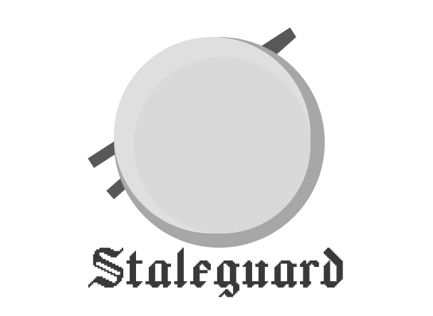

<p align="center">
  
</p>

# Staleguard

<p align="center">
  <a href="https://github.com/Arthur920/Staleguard/actions/workflows/ci.yml"></a>
  <a href="https://github.com/Arthur920/Staleguard/releases"></a>
  <a href="LICENSE"></a>
</p>

Keeps your agent instructions true. `CLAUDE.md`, `AGENTS.md`, Cursor rules,
and slash commands name paths, scripts, and env vars. When the code moves on,
the agent keeps running the dead command and editing the moved file, every
session. Staleguard finds those lines, and the same lies in your READMEs.
Local, deterministic, tuned for TypeScript.

```text
.opencode/commands/create-plan.md
   10  path `.agents/skills/create-plan/SKILL.md` does not exist
   14  path `scripts/create-plan.ts` does not exist

AGENTS.md
   45  path `routers/teams/create-team.types.ts` does not exist; did you mean `packages/trpc/server/team-router/create-team.types.ts`?
```

## Install

```bash
npx staleguard check
# or: brew install Arthur920/tap/staleguard
# or: cargo install --git https://github.com/Arthur920/Staleguard
```

## Let the agent check itself

Add a `Stop` hook to your `.claude/settings.json`. Before Claude Code finishes, it
sees any drift its own changes introduced and fixes it:

```json
{
  "hooks": {
    "Stop": [
      { "hooks": [{ "type": "command", "command": "staleguard check --diff HEAD >&2 || exit 2" }] }
    ]
  }
}
```

## In CI

Fail a PR only on drift it introduces:

```yaml
- uses: actions/checkout@v4
  with:
    fetch-depth: 0
- uses: Arthur920/Staleguard@v0.5.0
  with:
    args: --diff origin/${{ github.base_ref }}
```

SARIF, pre-commit, config, and what exactly is checked: [DETAILS.md](DETAILS.md).
