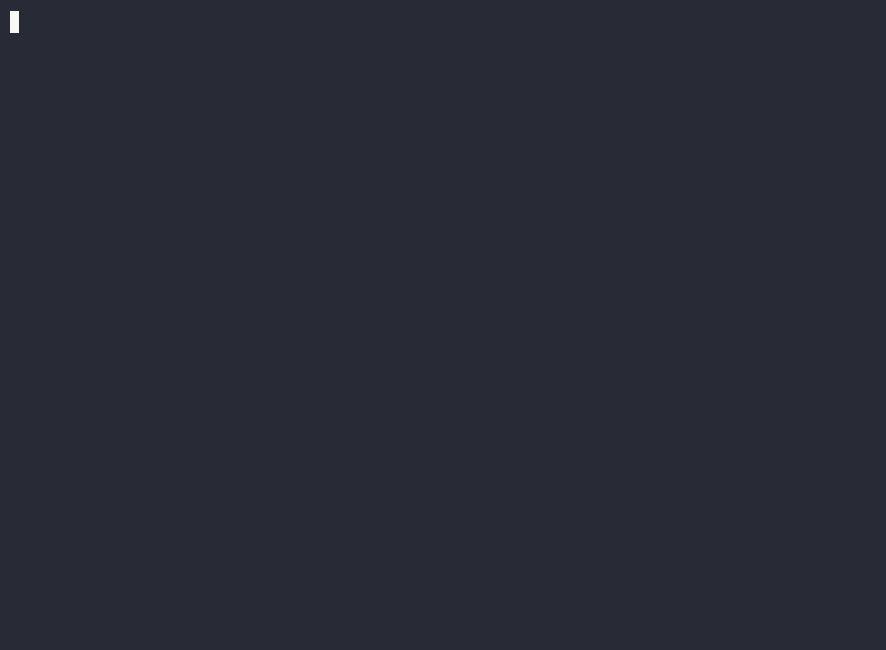

<p align="center">
  
</p>

# Staleguard

<p align="center">
  <a href="https://github.com/Arthur920/Staleguard/actions/workflows/ci.yml"></a>
  <a href="https://github.com/Arthur920/Staleguard/releases"></a>
  <a href="LICENSE"></a>
  
  
</p>

Staleguard catches **documentation drift**: places where your READMEs, `CLAUDE.md`,
and `*.md` / `*.mdx` docs claim something the code no longer backs up. It checks docs
against the actual codebase and reports what's stale, wrong, or missing.

Everything runs locally and offline. It is **deterministic** (no model, no API) and
tuned for **zero false positives**. Every finding points at a concrete path,
command, env var, flag, or symbol that the docs got wrong.

Findings cover broken references (paths, commands, env vars, flags, code
symbols) and undocumented public surface. A CI alignment score tracks drift
over time.
[DETAILS.md](DETAILS.md) has the full breakdown.

<p align="center">
  
</p>

## How it works

Staleguard checks paths, commands, config keys, env vars, flags, and code
symbols named in your docs against the real codebase and reports only what it
can prove wrong. It is fully deterministic (no models, no network) and runs in
~1.2s on a 330k-line repo.

## Install

```bash
# Homebrew (macOS / Linux)
brew install Arthur920/tap/staleguard

# or the install script (macOS / Linux)
curl --proto '=https' --tlsv1.2 -LsSf \
  https://github.com/Arthur920/Staleguard/releases/latest/download/staleguard-installer.sh | sh

# or from source
cargo install --git https://github.com/Arthur920/Staleguard
```

(Windows: a PowerShell installer is attached to each
[release](https://github.com/Arthur920/Staleguard/releases). Recent Homebrew
versions prompt to trust third-party taps; run `brew trust arthur920/tap` if
asked.)

Then run:

```bash
staleguard check                 # full repo
```

## CI integration

`staleguard check` exits non-zero on any finding or a score regression, so it drops
straight into a pipeline. Commit a baseline on your main branch, then gate PRs
against it:

```bash
# once, on the base branch: records the alignment baseline under .staleguard/
staleguard check --write-ledger

# in CI on each PR: fail only if alignment regressed below the baseline
staleguard check --fail-on-regression
```

### GitHub Action

A reusable action installs the binary and runs the check for you:

```yaml
- uses: Arthur920/Staleguard@v0.3.0
  with:
    args: --fail-on-regression       # passed through to `staleguard check`
```

To get findings as inline PR annotations and entries in the **Security → Code
scanning** tab, emit SARIF and upload it:

```yaml
- uses: Arthur920/Staleguard@v0.3.0
  id: staleguard
  with:
    format: sarif
    args: --min-severity warning   # the default: provable drift only (see below)
- uses: github/codeql-action/upload-sarif@v3
  if: always()
  with:
    sarif_file: ${{ steps.staleguard.outputs.sarif-file }}
```

**Severity and default output.** A fresh scan of a large repo reports a
lot of `undocumented` findings (public surface no doc mentions); those are
`note`-level and advisory. The default threshold is `--min-severity warning`,
which drops them and keeps only provable drift: broken references and
contradictions. Severity ranks `note` < `warning` < `error`; raise to
`--min-severity error` for the strictest gate, or pass `--min-severity note` for
the full coverage report including the undocumented surface.

Action inputs: `args`, `format` (`text`/`json`/`sarif`), `version`, and
`working-directory`. Or call the binary directly:

```yaml
- run: |
    brew install Arthur920/tap/staleguard   # or: cargo install --git https://github.com/Arthur920/Staleguard
    staleguard check --fail-on-regression --format sarif > staleguard.sarif
```

### Pre-commit hook

Run the deterministic check locally whenever a doc changes, via
[pre-commit](https://pre-commit.com):

```yaml
# .pre-commit-config.yaml
- repo: https://github.com/Arthur920/Staleguard
  rev: v0.3.0
  hooks:
    - id: staleguard
```

### Configuration (`.staleguard.toml`)

Drop a `.staleguard.toml` at the repo root to tune a run (all keys optional):

```toml
# Doc paths to skip, as globs relative to the repo root
# (`*` within a segment, `**` across segments; a bare name matches in any dir).
exclude = ["docs/legacy/**", "vendor/**", "NOTES.md"]

# Verdict categories to drop from the report and the failing set. One or more of:
# "contradicted", "stale", "unverifiable", "undocumented".
suppress = ["undocumented"]

# Drop everything below this severity (note < warning < error). Same effect as
# `--min-severity`, which overrides it. Defaults to `warning` (hides the
# undocumented notes); set `note` to keep the full coverage report.
min_severity = "warning"
```

Both suppression and the severity threshold affect the alignment score:
filtered-out claims (e.g. the `undocumented` notes hidden by the default
`warning`) drop out of the denominator, while `Supported` claims are always kept.
So a stricter threshold or more suppression reports a higher score over the
claims that remain. The score describes what you chose to check, not the whole
repo.

## Use it in AI-assisted coding (MCP / agents)

Staleguard is a CLI with `--format json`, so any coding agent can run it and read
the findings back. Two ways to wire it in:

**1. As a tool the agent runs directly.** In Claude Code (or any agent with shell
access), let it call:

```bash
staleguard check --format json --diff main
```

A standing instruction for `CLAUDE.md`: *"After editing code or docs, run
`staleguard check --format json` and fix any reported drift before finishing."*

**2. As an MCP server.** Expose staleguard over the Model Context Protocol with a
thin command-runner MCP (e.g. a generic "run this CLI" server), mapping a
`check_doc_drift` tool to `staleguard check --format json`. The agent then calls the
tool and receives the structured findings as context without needing shell access.
The JSON output (one object per finding: layer, verdict, doc ref, code anchor,
detail) is the contract to map onto MCP tool results.

Either way, point the agent at the JSON output and feed `contradicted` / `stale`
findings back as fixes.

## Build

```bash
cargo build                          # debug binary at target/debug/staleguard
cargo test                           # unit tests
```

---

This is a heavily AI-assisted personal project; see [DETAILS.md](DETAILS.md#about-this-project).
[DETAILS.md](DETAILS.md) also has the full feature breakdown, performance numbers, and env overrides.
